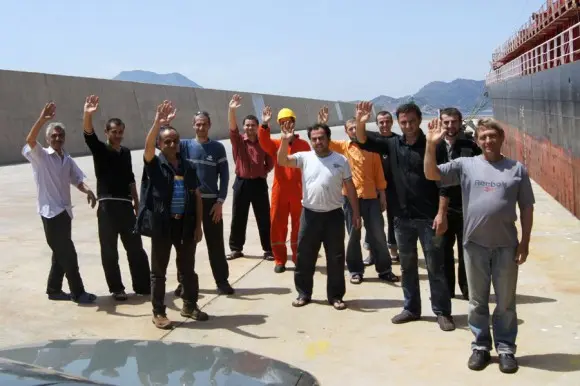
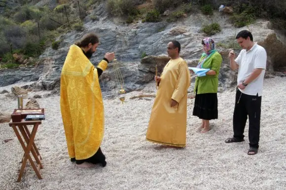
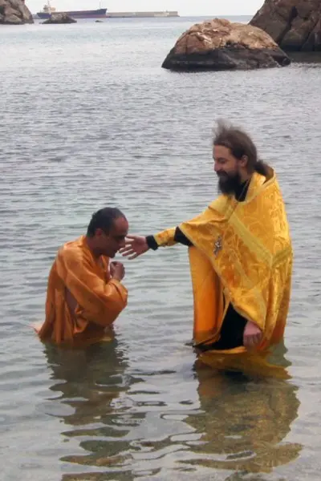
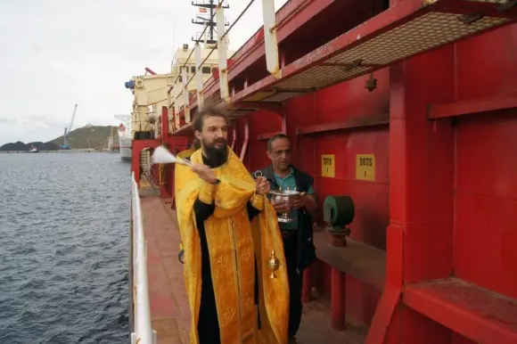
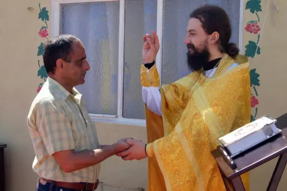

# A Muslim is Baptized

> Author: ADMIN

> 2011/06/08

> [pravmir.com](https://www.pravmir.com/a-muslim-is-baptized/)

> They drifted for a long time, unable even to send out an SOS. There was nothing to eat or drink and the crew began to get alarmed. Everything they tried ended in failure. Despair set in. There were over thirty in the crew, Georgians, Syrians, Turks and two Ukrainians. Their only hope was in God.

This story comes from Archpriest Zacharias Kerstyuk, who works for the external relations department of the Ukrainian Orthodox Church of the Moscow Patriarchate. Fr Zacharias used to look after the parishioners at St Andrew’s Church at the Ukrainian Embassy in Tripoli in Libya, but now serves in Spain.

### The Muslim

He is Turkish, a ship’s captain and travels all over the world. He is 49 years old and has spent 25 of those at sea and has been in all sorts of difficult situations. He is a clever man and speaks some five languages.

### At Sea

This spring his ship was in the Atlantic, when suddenly it broke down. The main engine stopped and the generators packed up.

They drifted for a long time, unable even to send out an SOS. There was nothing to eat or drink and the crew began to get alarmed. Everything they tried ended in failure. Despair set in. There were over thirty in the crew, Georgians, Syrians, Turks and two Ukrainians. Their only hope was in God.

### Prayer

The Muslim captain began to pray for help. He also saw how sincerely the Georgian Orthodox prayed. Then he himself turned to Jesus: ‘If Jesus helps me, then I’ll become a Christian’, he decided. The day was not over before the engines came back to life.

They reached Algiers on the smoky engines, but the port would not take them in. All they would do was allow them to take some food and drink on board and anchor in their territorial waters. They stood at anchor for a whole month there, waiting for spares from the shipping company. Refusing to wait any longer for help from the ship’s owners, the IMO (International Maritime Organization) ordered them to proceed to the nearest European port. This was Cartagena in Spain. The ship stopped five miles from shore – it had run out of fuel. With great difficulty they were towed into port.

### The Baptism

Since there were Ukrainians on board and I am a Ukrainian, I was at once contacted about the irregular situation in which our nationals were involved. I went aboard and met the Ukrainians who introduced me to the rest of the crew. I spoke at length with the captain about Orthodoxy, about God. I saw that the man had really taken a conscious decision.

I had three preparatory talks with the captain. Since this was a very important step I received his wife’s permission. These people had been born into Islam but only kept it superficially, just like the many who among us call themselves Orthodox only because they were baptised in it in childhood.

The wife said that she accepted her husband’s decision, as that was his will.

The man said to me: ‘I want to be Orthodox, Jesus helped me, I’ll keep everything that is asked of me because I believe’. Seeing such a firm will in him, I baptized him in the Mediterranean Sea.

He told me that he had never sensed or felt the presence of God in Islam, but he could feel Jesus in his heart. The next Sunday the captain came to communion for the first time.

### The Crew

The captain invited his friends to the service, six of whom also took communion. I have not seen people taking communion with such devotion for a long time the way he did. At the moment another two sailors in the crew also want to get baptized. We are having preparatory talks and I hope to baptize them next week.

At my first talk with the captain, I asked: ‘Aren’t you afraid that the Muslim sailors will cut your throat?’ He answered: ‘So what, I’ll lock the doors tighter at night’.

During the talk Muslim sailors came along and looked at me in such a way that I felt frightened. The second meeting was much more pleasant and the third very easy. I answered their questions. We spoke about life, joked and I showed them crosses which I offered them.

They took them, put them on and I heard them talking to each other: ‘Perhaps it’s true and Jesus did help?’ After that I went to see them again and I saw them, Syrians and Turks, still wearing the crosses around their necks as before. Having been at death’s door, these people can now make sense of a lot more.

> Story taken down by Elena Verbenina
> Translated from [russian blog](https://www.pravmir.ru/kreshenie-musulmanina/) by Fr. Andrew Phillips

