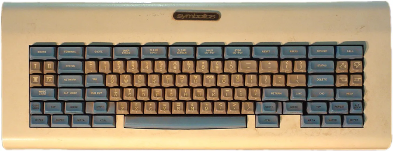
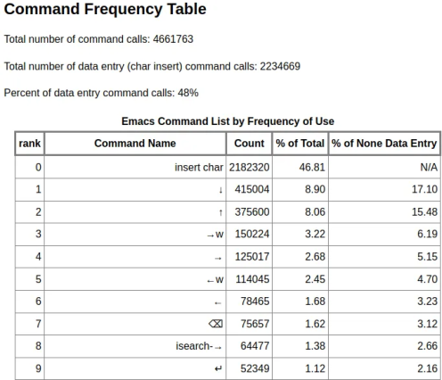
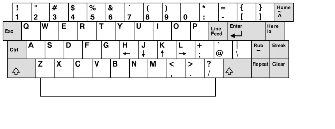
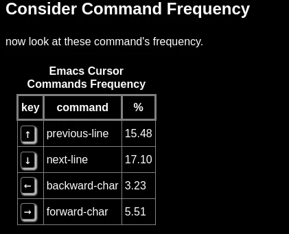
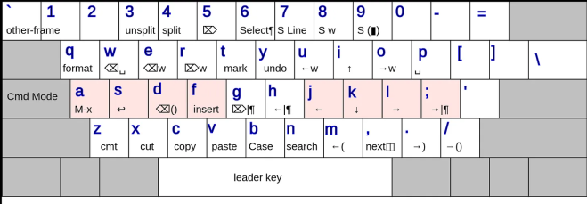
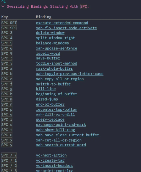

# Enhancing Emacs Efficiency with Xah Fly Keys

> [source](https://www.deusinmachina.net/p/modal-editing-with-emacs-using-xah)

> Diego Crespo, Jul 20, 2023

> Date accessed: 2024/06/20

Emacs key shortcuts were originally developed for keyboards that featured keys like "Hyper," "Super," "Meta," and "Greek." Much like qwerty these anachronisms continue to influence modern day computers. Despite the shift away from such keyboards, Emacs has mostly retained its original key bindings. Consequently, users often complain about Emacs shortcuts causing "Emacs Pinky," leading to frequent rebinding of the Caps lock key to Left Control (which, I argue, is worth it even if you don't use Emacs).

Created by Xah Lee in 2013, Xah Fly Keys (XFK pronounced Ksaw Fly Keys) is a minor mode designed to enhance the ergonomics of Emacs keybindings. Lee developed this modal navigation system after experiencing RSI pain from decades of prolonged keyboard use. To create shortcuts for this new mode, a table was compiled, listing the frequencies of each Emacs command using a keylogger.

Then, the following principles were applied when designing the new shortcuts…

Home row keys are the best.

2nd and 3rd fingers (pointing finger and index finger) are better than 4th (ring finger) and 5th finger (pinky).

The row above home row is considered better than the row below home row for 2nd and 3rd fingers. (for 5th finger the row below is considered better.)

Right hand's keys are considered better than left hand's keys. (because most people are right handed)

Alt is considered better than Ctrl. (Alt is a natural thumb curl, Ctrl is stretched pinky. Thumb is most powerful finger, pinkie the weakest)

In general, cursor moving commands are placed all for the right hand, while text changing commands are all placed for the left hand. (grouping advantage)

Similar commands should be grouped together to avoid scattering. For example, cursor moving by single char is together (I J K L). Undo, Cut, Copy, Paste are together (Z X C V). Delete char/word left/right are together (E R D F).

Commands with logical reversal or extension are done with Shift key, after other priorities are considered. Examples: Undo/Redo, move cursor to previous/next pane, find replace by string/regex, isearch forward/backward, move cursor by beginning/ending of line. Delete line to the right/left.

This culminated in the creation of Xah Fly Keys , a modal text editing system specifically tailored for Emacs users, developed by Emacs users. The project proudly claims to be "the most efficient keybinding for Emacs" on its GitHub page. While XFK adopts modal editing, it does not adhere to Vim's movement conventions like using hjkl. The rationale being Vim's use of hjkl for movement is rooted in a keyboard anachronism and not ergonomics. When Bill Joy developed Vi the predecessor to Vim, the ADM-3A terminal he used had an arrow layout on the HJKL keys. He adopted the same set of keys to navigate in his modal editor.

Additionally, the escape key on the ADM-3A was more accessible compared to most modern keyboards, and so became the key that switched you into command mode. The problem with HJKL is that the "proper" touch typing technique on modern keyboards requires placing fingers on "ASDF" and "JKL;". This means moving left in Vi/Vim necessitates shifting the pointer finger laterally off J to reach H. Vertical finger movements are more ergonomic than lateral movement, so XFK utilizes IJKL for navigating instead. Their shape forms an inverted T like the arrow keys on the keyboard. Using IJKL for movement, and the easy to hit I for ‘Up’ has more than just ergonomic benefits. When programming we move up and down more than we travel left and right, so making vertical movement easier pays dividends over a long programming career. This imbalance in movement was also reflected in the command frequency chart.

After Xah Lee had compiled the list of the most frequent commands, and had worked out what fingers and positions were best for ergonomics it was time to create the actual shortcuts. XFK tries hard to follow these conventions when implementing shortcuts (on top of the 8 rules laid out above for ergonomics). A shortcut that is a single key press is the best (reserved for the most commonly used operations), then a sequence of keys IE. typing the combination Space o Space in sequence without having to hold down any key, and finally modifier shortcuts like your common C-x, C-c, C-v for cut, copy, and paste which require holding down a modifier before pressing the next key. As you can see in the diagram below, the most common actions for command mode are all within easy reach and a single key. Lee also tries to keep destructive edits to the left hand, and non destructive edits on the right hand.

> Diagram of functions in Command mode

Considering that invoking functions through Meta-x (holding Alt+x on the keyboard) or C-x (Ctrl+x) are common in Emacs, XFK assigns special importance to these combinations. Meta-x gets a place of honor on the home row and requires a single key ‘a’ to activate, making it not only ergonomic, but efficient. For shortcuts that begin with C-x, the Space or ‘leader’ key replaces holding down Ctrl and X. For instance, C-x C-f (find-file) becomes Space i e, and C-x h becomes Space a. This approach offers several benefits, such as reducing long combinations like C-x r l (bookmark-bmenu-list) to Space i i. Key sequences share an additional advantage of not anchoring your hand to a specific area of the keyboard, allowing a larger space of keyboard shortcuts to be performed without much effort. This means that XFK has shortcuts for previously unassigned but useful functions (e.g. Space l d activates eshell).

> A list of some of the functions bound to the leader key in XFK

Unfortunately, the key combinations in XFK do not adhere to mnemonics as extensively as those in Emacs and Vim. However, this design choice brings an advantage. In Emacs you can move the cursor up, down, left and right with C-p, C-n, C-b and C-f, which correspond to Previous, Next, Back, and Forward character. These keys happen to be relatively easy to hit on a qwerty keyboard. But if you use an alternate keyboard layout (for either language or efficiency reasons), then these letters might be in inconvenient spots on the keyboard, causing your hand to experience more strain when trying to hit them.

XFK is layout independent, as no action is tied to any particular letter. Any letter that is assigned to a keybinding is simply a consequence of how easy it is to hit, assuming you place you hands on the home row. This means that XFK works just as well in Dvorak as it does in Qwerty. The navigation keys for example, are IJKL, on Qwerty. In Dvorak, those sames keys are HTNS, but if you are a touch typist this difference is inconsequential. My muscle memory enables me to navigate seamlessly in command mode regardless of whether the keyboard layout is Workman, Dvorak, Colemak, or any other variation of Qwerty when using XFK. Because of this feature, Xah Fly Keys supports a wide range of keyboard layouts. The configuration variable xah-fly-keys-set-layout accommodates the following keyboard types, sound off in the comments if you use any of them :).

adnw , azerty , azerty-be , beopy , bepo , carpalx-qfmlwy , carpalx-qgmlwb , carpalx-qgmlwy , colemak , colemak-dhm , colemak-dhm-angle , colemak-dhk , dvorak , koy , neo2 , norman , programer-dvorak , pt-nativo , qwerty , qwerty-abnt , qwerty-no (qwerty Norwegian) , qwertz , workman

Additionally, as an ergonomics enthusiast, Xah invests significant time optimizing XFK for ergonomic keyboards he reviews and buys. For example, he has shared an image on his website featuring the layout modifications he made to the popular glove-80 keyboard to optimize it for XFK.

So what’s the catch? 🎣
With all of the advantages to efficiency and ergonomics, XFK can seem like the perfect set of navigational shortcuts. But like all things, there are tradeoffs. Vim keybindings enjoy greater ubiquity. You’ll see Vim style movement in things like terminal multiplexers, browsers with the Vim extension, or other text editors with a Vim emulation layer. Even Emacs itself supports this with viper and evil mode. Also many popular flavors of Emacs like Spacemacs and Doom Emacs come with Vim emulation turned on by default. By learning XFK, you commit to an Emacs specific workflow with a set of bindings that does not translate to other editors like VS Code or Intellij.

Additionally, using a modal editing interface with Emacs has its downsides. While these emulation layers are very mature, Emacs was not designed from the ground up with these keybindings in mind. Certain modes like dired, magit, or the help buffer, try be convenient for the user by rebinding specific shortcuts when their window is focused. For example, in all of these modes, simply hitting the letter ‘q’ will close them. But when using XFK or other modal editing modes, these buffers open in command mode, requiring you to first enter into insert mode before being able to use the expected shortcuts. These along with the little annoyances that come with interacting with the minibuffer while searching files or writing regexes are a reminder of that you are using Emacs in a non standard way.

Then there are the downsides to the modal editing paradigm itself. The major one is not having access to all of your shortcuts at all times like you do when using a non modal paradigm. I run into this all the time when I need to make a quick edit to a line of code inside some parenthesis, then I need to make a quick edit directly outside of the parenthesis on the same line. Having to enter into command mode just to move a couple of spaces just feels bad. Having to exit command mode just to make a quick change to a misspelled word before entering back into command mode also feels bad. Thankfully when in insert mode many of the regular Emacs keybindings still work, so you can still navigate the “normal” way. This is definitely an advantage if you already know a few traditional Emacs keybindings. But is also an additional layer of complexity. Finally, in regards to XFK, it sometimes sacrifices efficiency or a convenient mnemonics for its shortcuts in service of ergonomics. For people poor memory, or those who don’t experience RSI, this can be a source of friction.

Overall my experience with XFK has been a positive one. It is an interesting take on modal editing, and it has made me curious to try other navigation philosophies. I’ve even become interested in creating my own set of navigation shortcuts through the ryo-modal Emacs package. The prospect of a keyboard independent modal layout like XFK, but whose text editing shortcuts are closely tied to language server protocol specific features such as code completion, documentation lookup, as well as navigation shortcuts based on the abstract syntax tree of a programming language through Tree-sitter grammars (something like combobulate), seems really appealing. It would also have predictable and portable behavior across editors who implement that functionality. But it also seems daunting, so maybe I’ll just stick to what other people have come up with for now.

