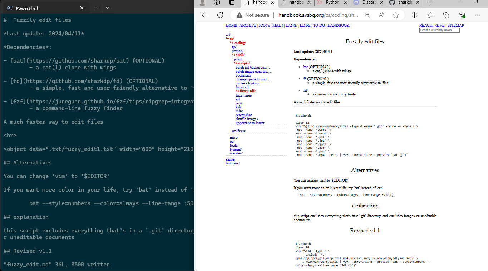
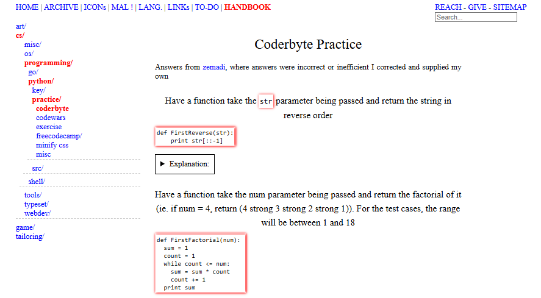
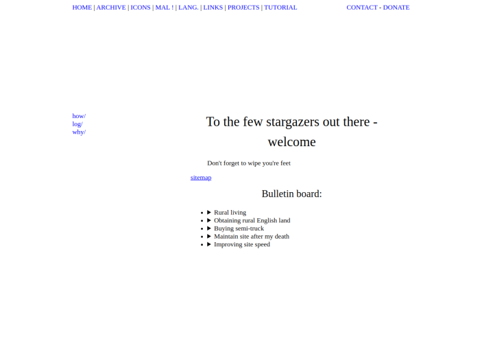
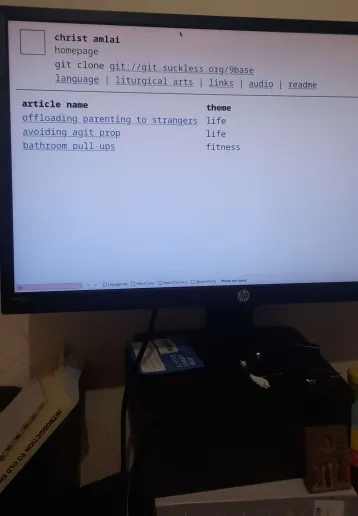
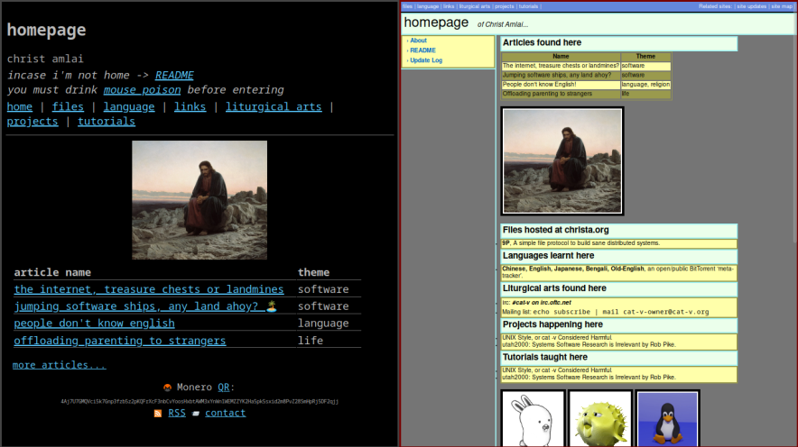
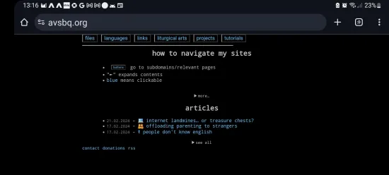
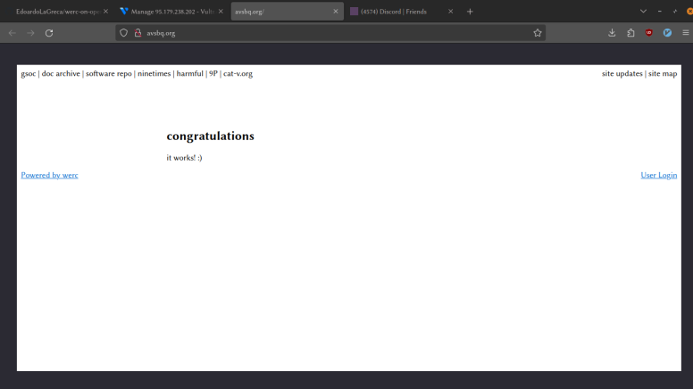
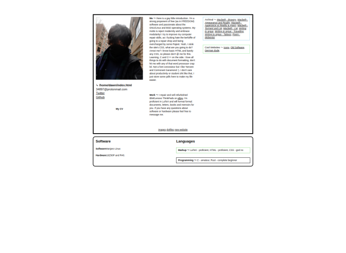

# More recent

# christc4.github.io

# SSI (.shtml) arc

# Werc arc

# OLD

<video width="320" height="240" controls>
  <source src=".pix/dark.webm" type="video/webm">
  Your browser does not support the video tag.
</video>
