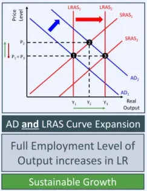

# With reference to Figure 1, explain one possible reason for the changes to interest rates during 2008.

Two key elements required in this answer:
- Identify and explain one reason
- Make reference to the data provided

## Financial Crisis - Recession

At the start of 2008, the US Federal Funds rate stood at 3%. It soon fell down to 2% before falling again towards the end of 2008 down to 0.25%
Extract B highlights that 2008 was the year of the financial crisis. THis meant it was a time of recession for the US. A fall in interest rates is an example of expansionary monetary policy,  usually implemented during recessionary periods to stimulate AD. This ensures that recesionnary effects on growth and unemployment are somewhat neutralised.

## Financial Crisis - Lending

A financial crisis leads to banks failing and acting in a conservative manner regarding lending can have disastrous effects upon an economy. Businesses and consumers can no longer access credit, reducing their economic activity. Therefore, reducing interest rates encourage banks to increase their lending as the opportunity cost of doing so (the interest paid if they keep their funds as deposits with the central bank) is lower.

## 2008 Sub-prime mortgages

Extract B touches upon the fact that it was the US housing market which "fired the starting gun" on the US financial crisis. Howe owners were finding it difficult to make their mortgage repayments and were therefore defaulting on their debt on an alarming scale. One of the many reasons central banks reduced interest rates may have been to try and reduce the mortgage costs for home owners in order to help alleviate this crisis.

> There are likely to be up to 2 marks available for identifying and explaining a reason, up to 2 marks for clearly identifying the change in the date with references to specific data points, and finally 1 mark available for making a link between the reason and the change in the data.

## With reference to Figure 2, examine the likely impact of the trend in consumer confidence between September 2016 and January 2017 on US economic growth.

Consumer confidence refers to how positively/upbeat consumers, on average, in an economy feel about the economy and their own prospects. Data about consumer confidence is usually collected through polling companies and thinktanks, whick survey consumers on how confident they feeel about the economy. In September 2016, US net consumer confidence was negative, hovering just below a rating of -10. However, over the following months it is proceeded to increase sharply, reaching a net positive rating around +10 by January 2017.

## Impact on Growth

Increasing consumer confidence has important implications for aggregate demand. Consumers who are more confident about the state of the economy are likely to engage in more consumption. Businesses who witness this may increase their levels on investment to take advantage of the more buoyant economy.

Both consumption (C) and investment (I) are components of AD. As a result, increasing consumer confidence is likely to cause an increase in aggregate demand.

An increase in AD leads to an increase in the real output of the economy in the short-run. An increase in real output represents economic growth, so we can interpet this as an increase in growth.

This explainsn the standard economic result of an increase in consumer confidence causing an increase in growth in the short-run.

## Evaluation

Spare Capacity.

The impact that increasing consumer confidence has upon growth is likely to depend upon the initial state of the capacity. Keynesian analysis argues that if the economy is already close to full employment then an increase in aggregate demand is likely to have a mostly inflationary effect with negligible impact on economic growth. However, if the economy iniitially has spare capacity, the impact upon growth might be high.

Sustainability

An increase in consumer confidence over a few months is is likely to have less of an effect compared to a sustained level of high confidence over several years, if confidence is sustained it is much more likely to lead to the theoretical increases in consumption and investment which causes higher short-run economic growth.

Causality

It may be that rather than higher confidence causing economic growth, that the correct direction of causality is that higher growth causes higher confidence.

# With reference to the information provided, discuss the likely impact of an increase in US interest rates on the US housing market and consumer confidence

## Knowledge and Understanding

> Signal to the examiner you have sound knowlede, weave together definitions in your introduction

The increase in interest rates witnessed in the US has significant implications all over the US economy. One sector that will, perhaps most prominently, be affected is the housing market. The demand for housing is defined as the number of houses that consumers are willing and able to buy at a given price. Housing is predominantly financed through mortgages in developed economies liike the US. An increase in interest rates means that mortgages become more expensive and therefore a house at a given price becomes less appealing to consumers.

## Impact on Housing Market

> The analyis most logically should start with what is meant by rising interest rates.

Rising interest rates most notably refer to the US Federal Reserves' base rate (the Federal Funds rate). This is a very specific interest rate, which governs funds deposited at the central bank by large financial institutions. However, increases to this interest rate do tend to filter through the economy and affect other interest rates.

This is because the opportunity cost a bank suffers when it lends out money, for example in the form of a mortgage, is now higher as it is forgoing the opportunity to enjoy a higher interest rate itself by depositing with the central bank. To overtome this, the banks need to charge higher interest rates on the funds they themselves lend out.

> This leads itself into a thorough explanation of how this impacts the housing market.

If consumers are faced with higher interest rates when applying for a mortgage, this will reduce the demand for housing. It makes the process of buying a house more expensive for the large proportion of the population who do so via mortgagee finance. At any given house price, with the cost of mortgage finance increased, there will be less demand for housing.

> To best showcase the effects of this reduction in demand effectively, a diagram is required. Accurate diagrams include the following: correctly labelled axes, original curves drawn and initial equilibrium, contractions in the demanad curve, new equilibrium identified.

> Notice that the supply curve has been drawn as a price inelastic supply curve (with a steep gradient). That is because, in the short-run, it is very difficult to alter the supply of housing as there are significant time lags involved with the creatin or destruction of housing. The significance of that is that the demand curvve shift primarily impacts the equilibrium price within the market rather than the quantitiy.

## Accompanying explanation for the diagram

Reduced demand for housing is represented in the supply and demand diagram by an inwards shift in the demand curve from D1 to D2. This causes the market equilibrium to change. The most significant effect is a large reduction in the market price from P1 to P2. The size of this price fall is large because, in the short-run atleast, the supply of housing is price inelastic. This is due to the significant time lags and capital required to build new houses. THis is also the reason why the market quantity of housing is affected little.

## Defaults

The sub-prime mortgage crisis which stimulated the 2008 financial crisis arose because home owners could not afford the repaymentss for their mortgage and the housing market crashed. An increase in interest rates does not only impact potential home buyers, it also affects home owners who are currently making mortgage repayments. 

If the incrrease in interest rates causes these repayments to increase, some home owners may no longer be able to afford them and may either default on their mortgage or decide to sell their house to move to somewhere more affordable. If you use a supply and demand diagram to represent huse available for sale rather than the entire housing stock, this could be represented by an outwards shift in the supply curve.

> Supply shifts outwards, S1 to S2. As homeowners, put up houses for sale. Demand shifts inwards.

This analytical route suggests that house prices are likely to fall even more severely. To avoid such a scenario, however in the wake of the 2008 crisis, governments including the US have tightened regulation to ensure that mortgage lenders assess the affordability of mortgages even in the event of significant interest rate rises.

## Long-run impact

In the long-run, changes to interest rates may affect the supply of housing significantly. If rising interest rates do indeed cause demand to fall and prices to drop, housebuilders may be reluctant to proceed with housebuilding projects. The lower house prices indicate that the potential profit available for such building projects is lower.

## Impact on consumer confidenceA

Having concluded that rising interest rates are likely to cause house prices to fall, this proviides a natural link in the chain of reasoning towards the impact on consumer confidenc.

The housing market is one of the most important markets in the economy. A fall in the pricee of houses means that home owners all across the economy feel poorer. This is primarily through two avenues.

If they own their house outright, the fall in the value of one of their largest assets make them less wealthy. With less wealth, their confidence is likely to be shaken and they are likely to be more frugal with consumption decisions.

If they have a mortgage, then rising interest rates mean that their mortgage repayments each month are likely to be higher. This, in turn, means that they have less disposable income to engage in other consumption. This is likely to affect their confidence.

Rising interest rates are also likely to reduce consumer confidence through other channels. For example: Higher interest rates mean that consumer borrowing is likely to become more expensive. This includes personal finance deals for the purchase of a new, all the way down to any debt accumulated on a credit crad. With knowledge that any debt they accumulate is likely to be more expensive, consumers may have less confidence about the prospects of the economy.

## Evaluation

## Time frame/lags

Discussing the fact that the outcomes may differ in the long-run compared to the short-run, like we have done in the analysis sections above, is a good way to evaluate the impact of rising interest rates.

You may also want to touch upon the fact that monetary policy usually has a significant time lag between implementation and it having an impact upon the economy. This may mean that in the months following the change in interest rates (the very short-run) there is little to no effect.

## Price elasticity of supply

We have discussed that the PES for the housing market in the short-run is likely to be highly inelastic due to the time lags involved in housebuilding. Demonstrating an awareness of the impact upon prices of the extent to which this is the case is a good way to weave some evaluation in to your response.

Railway infrastructure projects are unlikely to rely upon using pure crude steel. Instead, they are likely to require specialised preducts made out of steel. The impact, then, that a reduction in the steel price has, will depend upon whether the intermediary firms which produce the specialised final products pass on the lower price or not.

## Ceteris Paribus

Much of the analysis is dependent upon all other things remaining equal. The impact of rising  interest rates on the housing markets and consumer confidence may be diluted or exacerbated by fiscal policy decisions or other significant markets throughout the economy.

## Transmission Mechanism

The extent to which changes made to interest rates by the central bank affect the housing market and consumer confidence depends upon how effective the transmission mechanism is. THat is, how sensitive commercial banks are with regards to changing their interest rates (particularly for mortgagess) in response to a change in the base rate.

# With reference to the information provided and your own knowledge, evaluate the possible microeconomic and macroeconomic effects on the UK economy of an increase in US interest rates?

> To access top marks in any economics essay, it is important to focus on two key elements, the different assessment objectives and the essay structure

Interest rates refer to the price paid by borrowers to lenders for the benefits of borrowing money. Manipulation of interest rates throughout the economy is one of the primary monetary policy tools available to central banks. An increase in interest rates has consequences throughout the economy. For example, potential investors can now expect to enjoy larger returns on their money.

## AO2 Extract application

Extract A (Lines  1 to 5), this explains the importance of the US as the world's largest economy. It suggests that decisions taken about US monetary policy affeect other countires as well as its own. Extract B (Lines 1 to 5), this provides context in the form of the recent history of US interest rates. It describes how during the financial crisis of 2008, US interest rates were dragged down from over 5% to a record low to 0.25%. It also explains how they have been slowly increasing recently, up to 1% by March 2017. This could be used as a useful evaluative point to explain that whilst interest rates are rising, they are rising quite slowly and are nowhere near the levels they have been previously. Extract B (Lines 6-9), explains some of the reasons why the US Federal Reserve have taken the decision to increase interest rates. It details that inflation has been increasing up to 2.71 and unemployment in the US is down to 4.7%. This can be used to as avenue in to a discussion about the stage of the business cycle the US finds itself in. High-end responses may also consider that these effects may also be afflicting the UK economy andn it itself may also raise interest rates. Extract B (Lines 18 to 22), this explains the US Dollar's role as the world's reserve currency. It explains that changes to US interest rates have a particularly large impact upon developing economies who often denominate their government debt in US dollars. Extract B (Lines 23-24), this provides the largest hint that one of the main effects, from the UK's effect perspective, of rising US interest rates is via the foreign exchange markets. This analytical stand is likely to be a signigicant part of most responses. Extrat B (Lines 27-30), this explains that the US is a large trading partner for the UK and that the UK has many significant businesses which operate in the US and bring profits made back to the UK.

## Analysis

The heart of the analyis is likely to involve discussing the impact of an increase in US interest rates on the US-UK exchange rate and the subsequent impact on net trade for the UK. Once that has been outlined, it provides a platform to discuss the precise impact upon the UK's macroeconomic objectives. It will also be possible to weave in plenty of evalutaions as the topics under consideratios lend themselves well towards critique.

## Impact on exchange rates

An increase in US interest rates has a significant impact upon the rates of return that investors can expect upon all assets in the US. This ranges form the purchase of goverment bonds, through to investments in corporate debt. This increased rate of return means that US investments are more enticing for global investors. In turn, this means that investors are likely to demand more US dollars on the foreign exchange markets.

> The best way to demonstrate the effects this will have on the exchange rate is to draw a supply and demand diagram for the foreign exchange market. You could alternatively just explain the result via a written chain of reasoning.

The increaseed demand for dollars is represented by an outwards shift in the demand curve from D1 to D2. This causes the value of dollars to appreciate. This means that one dollar now is able to purchase more of other currencies, including UK sterling.

## Impact on trade

Looking at this from the UK's perspective, this means the Pound has depreciated against the US dollar. This has important implications for UK-US trade. US consumers are now able to buy UK goods at a lower cost in dollar terms. This is likely to stimulate increased US demand for UK exports. Conversely, UK consumers will now find that US goods and services cost more in pounds. UK consumers will demand fewer US imports. Taken together it means that the UK's net export rises.

## AD/AS analysis

Net exports (X-M) are a component of AD. A rise in net exports cause aggregate demand to rise. The effects on the UK economy can therefore be analysed with the assistance of a AD/AS diagram.

In the AD/AS diagram above, the economy is initially stationed at a macroeconomic equilibrium characterised by a price level of P1 and a real output level of Y1. Thee increase in aggregate demand  is modelled by an outwards shift in the aggregate demand curve. This forces the economy to reach a new macroeconomic equilibrium. This occurs at a higher level of real output Y2 and a higher price level P2.

## Macroeconomic objectives

The AD/AS analysis prompts discussion about the impact on the main macroeconomic objectives. These are to achieve strong economic growth, low and stable inflation, low unempploymnent, a good position on the balance of payments and some economists incluide limiting inequality.

In this cases, the first consideeration is that the increase in real output means that the economy is growing. It also implies, in turn, that unemployment iis likely to fall. On the other hand, the price level has risen and this can be interpreted as an increasee in inflation. Finally, an increase in net exports means that there will be an improvement to the curreent account of the balance of payments. As the UK currently runs a substantial deficit on the current account of balance of payments, this will be welcome news, this will be welcome news. Overall, therefore, the outlook is that in the short-run, increased net trade is positive for the main macroeconomic objective, with the exception of inflation.

## Spare capacity

Of course, above we have discussed just the direction of travel for the main macroeconomic objectives.  One way to introduce some advanced analysis is it consider the magnitude of these impact using Keynesian AS analyis. 

That is to say that the extent to which an increase in AD iss good for the UK economy deponds upon what state the UK economy is in intially. If there is sufficent spare capacity available, then it will predominantly increase growth and therefore unemployment with limited impact upon inflation. However, if the economy is close to full capacity, the opposite will be the case.

## Long-run/Supply-side impact

Thus far the AD/AS analysiss has focused mostly upon aggregate demand in the short-run. This implies that there is expected to be limited long-run impact. That is primarily due to there being no obvious suspply-side impact. It is possible that one could make the case that increasing exports to the US, a similar developed economy, may cultivate high-tech, high skilled industry in the UK which might provide the successful conditions for supply-side improvements. In which case there are likely to be positive long-run effects for the UK economy.

Failing this, however, it is worthwhile acknowledging the timeframe being considered is primarily the short-run and making a nod towards the negligible long-run effects predicted.

## UK companies operating in the US

A slightly different angle, albeit one which reaches similar conclusions, is to discuss the impact the changing exchange rate would have on UK companies who have significant operations in the US. Such companies, like BP, often bring 'home' their profits from other markets. The strongger dollar would mean that, such occurences would result in higher profits being logged in Pounds, increasing incomes (of shareholders and potentially employees) and confidence in the UK economy.

## Micro: Impact on UK exporting firms

> The question asks you to consider the microeconomic effects as well as the macroeconomic effect. Despite the question lending itself more towards a macro approach, there are avenues you can take to include some micro analysis. One would be to hone in on markets or firms who are involved significantly in exporting their goods or services to the US. Their market enjoys an increase in demand from the US, increasing the market price and output. This could be shown on a supply-demand diagram.

Individual firms are likely to enjoy higher profits as a result of the increase in demand. The extent to which these last for will depend upon the structure of the market: if it is competitive then more firms will enter, reducing profits in the long-run.

Firms, with the large US market in their targets, may be able to exploit economies of scale, thereby becoming more productively efficient

## Evaluation

## UK interest rates

Interest rates in the US are being increased by its central bank because the economic indicators are suggesting that the economy is in a strong state. It may be that the UK's central bank makes a similar conclusion about the UK economy and decides to increase interest rates there. If this occurs then the logic  surrounding higher interest rates in the US incentivising investors to incrrease their demand for dollars no longer holds, as similar great incentives will also be encouraging investors to purchase Pounds Sterling. This will cause the UK's currency to appreciate, meaning that the US-UK exchange rate may remain steady.

## Size of the rise in US interest rates

The magnitude of the effects discussed will depend upon exactly how large the increase in US interest rates are. By March 2017, US interest rates had risen only to 1%, not only a massive rise. Whilst it is likely they will rise further, the Federal Reseerve had indicated that rises are likely to be slow and measured.

## Marshall-Lerner

The logical chain of reasoning assumes that a depreciation in the value of the Pound Sterling relative to the US Dollar will increase the value of UK net exports. This is only true if the Marshall-Lerner condition; that is that the sum of the absolute values of the import and export elasticities is greater than 1. If this is not the case then the depreciation will actually cause the value of net exports to fall!

## US Consumption

Interest rates rise by a central bank are often implemented in order to try and deflate an economy. If this is successsful it may mean that the US economy's growth rate, and therefore its appetite for the UK's exports, declines. This might provide a headwind against the impact of the exchange rate change or net exports.

## Relative importance of macro objectives

You could argue that, given the UK's current significant balance of payments deficit, it would be valid to prioritise this over the other macroeconomic objectives.

## Two different conclusions

Overall, it is clear that the USA's current monetary policy has the potential to have positive effects on the UK, mostly by improving the UK's balance of payments position which is urgently in need of repair. Whilst the potential inflationary impact should not be ignored, the beest to the UK's exporting industries should take precedence and the UK government should welcome the development.

> Alternatively, it would be just as valid to argue that tightening US monetary policy is negative for the UK:

On balance, the prospect of increasing US interest rates is a worrying one from a UK perspective, if indeed it has much of an impact at all. The UK is approaching full empolyment, as indicated by its recent low unemployment figures and what it desperately needs is supply-side improvement, not further boosts to the demand side of the economy. Indeed, it may be wise for UK policymakers to anticipate the impart via trade channels and protect the macroeconomy by instigating their own increases in interest rates.

With reference to the information provided and your own knowledg. evaluate the possible micro and macroeconomic effects of increasing US consumer confidence on the global econoomy.

The US remains the largest economy in the world. As a result, the state of the US economy has a large impact on the overall global economy. Consumer confidenc reefers to the sentiment that consumers have about the state of the economy and their own personal economic experiences. If consumer confidence is increasing, it is a sign that the economy is in a buoyant state, possibly moving towards the 'boom' stage of the business cycle. This is likely to cause US growth and therefore global economic growth to increase, as well as having important implications for exchange rates,  trade and investment.

## Application

Extract A (Lines 1 - 5)

This explains that the US is the largest economy in the world and describes how this means that its performance has large implication for overall global economic performance. This may stimulate emphasis in your response about how the size of the American economy affects the importance of rising US consumer confidenc from a global perspective.

Extract A (Lines 6 - 14)

This discusses the structural change that has taken place within the American economy since globalisation started. It describes how labour-intensive manufacturing businessess struggled against competition from countries with low labour costs. It also, however, discusses the high-tech industries that the US has taken a lead in and that the fracking has encouraged a resurgence in American oil production.

Extract A (Lines 15 - 20)

This details how the US runs a persistent trade deficit and how the election of Trump has thrown light on trade deals. This might be used as a challenge to the 'ceteris paribus' assumption used. The theoretical effects that increasing confidence might have may be diluted by America retreating from global free trade.

Extract A (Lines 21 - 25)

This explains how the election of Trump and his 'pro-growth' agenda, including increases to spending on defence, seems to have inspired greater consumer confidence. This could be used to evaluate whether or not this confidence will be sustained or whether it is just a post-election polling bump.

Extract B (Lines 7 - 13)

This discusses the current state of the US ecoonomy. It highlights that inflation is increasing and uunemployment is low, but that growth is still sluggish. This could be used as an evaluative tool as evidence of whether the US economy has spare capacity or not.

## Analysis

## Impact on the US

When consumers have more confidence about the state of the economy and its future prospects, they tend to make more active consumption decisions. They will make purchasses now that they might otherwise have delayed. They become more willing too fund such purchases tby borrowing. The net result is that consumption increases.

Witnessing increased consumption and feeling the increased confidence throughouot the economy, firms become more likely to want to takte advantage of this by investing more. As a result, investment increases.

Consumption and investment are two important components of aggregate demand. Therefore, higher consumer confidence causes an increase in aggregate demand. We can analyse the impact of this using a AD/AS diagram.

Diagrametically, the increase in aggregate demand can be modelled by an outwards shift in the AD curve. Initially the economy is depicted at a long-run macroeconomic equillbrium with a price level of P1 and a real output level of Y1. The shift in the AD curve from AD1 to AD2 causes the economy to move up the SRAS curve until it reaches a new macroeconomic equilbrium. Here the economy now has a higher price level P2 and a higher real output  Y2.

This has implications for the main macroeconomic objectives. Higher real output suggests increaed economic growth and therefore, lower unemployment. The downside is that inflation increases. The effect on the current acount of the balance of payments is likely to be negative.

> You can argue a spare capacity versus full capacity arguement here.

The American economy currently has low unemployment and an increasing inflation rate which suggests that it is close to full employment. However, growth remains slow, hovering around 2% which might imply that there is some spare capacity available.

## Impact on the rest of the world

Increased US consumer confidence leads to US  consumers purchasing more goods. This includes imported goods. For economies who are significant experters to the US, this will result in an increase in their exports. Countries which fall in to this category include developed economies, like the UK, geographical neighbours, like Mexico and the low-cost manufacturing economies like China and India. This may indeed be exacerbated if higher US inflation makes US goods less competitive compared to the rest of the world.

An increase in exports leads to an increase in aggregate demand as net exports are a component of AD.

> This can be shown on a similar AD/AS graph as previously introduced.

Yet the difference betweeen benefits enjoyed by the US and the rest of the economy iss undoubtedly with regards to the balance of payments. The US suffers a deterioration in its current account of the balance of payments, whilst exporting countries enjoy an improvement.

## Other effects

In today's globalised world, the impact of the world's largest economy enjoying higher consumer confidence is not necessarily confined to the traditional analytical channel of trade.

The most obviiouos impact is that good news from America tends to lift  economies across the world. International investors enjoy a wealthh affect from holding American assets which are appreciatingg in value and this increases their ecoonomic activity in their own economies. Multinational companies are spurred on to increase investment across the globe. Most of this can be modelled as a general increase in AD.

> A more sophisticated answer may comment on the fact that globalisation has made AD for economies around the globe to move more consistently with each other. As evident when the financial crisis which originated in the US caused a slowdown in economic growth all across the world.

> Another chain of analysis could be the long-run impact. Consumer confidence increasing may have led to increased business investment. Higher investment spurs on supply-side improvements. Coming within the US, a pioneer for high-tech advancements, this may cause the global LRAS curve to shift outwards, improving the long-run prospects for the global economy.

## Micro: Impact on Export Firms

Individual firms are likely to enjoy higher profits as a result of the increase in demand. The extent to which these last for will deepend upon the structure of the market: if it is competitiive then more firms will enter, reducing profits in the long-run.

Firms, with the the large US markets in their targets, may be able to exploit economies of scale, thereby becoming more productively efficient.

## Evaluation

## Sustainability of Confidence levels

Whether US consumer confidence is high for a couple of months or several years will affect the magnitude of economic effects felt in the US and around the world.

## US Interest Rates

Further increases to US interest rates may dampen down the effects of any rise in consumer confidence, and may, in fact, reduce consumer confidence itself. This is a classic effect of contractionary monetary policy. Indeed, the fact that the US central bank is acting to increase interest rates could be used to suggest that the economy is close to full capacity and increasing consumer confidence needs to be watered down to avoid highly inflationary effects.

## Size of trade with the US

The impact on economies around the world of rising US consumer confidence will depend, partly, upon how important the US is as a trading partner. If a country trades little with the US, then they may derive little to no benefit at all.

## How confident

The premise of the question is that consumer confidence is increasing. It can be argued, however, that the increase in confidence is rather small. A poll rating of +10 indicates that only 10% more people have high confidence in the economy than have low confidence. This is hardly a unanimous vote of confidence in the prospects for the US economy.

For a global economy, which has been sleep-walking  its way through recovery from the 2008 financial crisis, increasing consumer confidence has the potential to provide just the stimulus it needs. The impact it will have on economic growth in the US will promote confidence throughout the globalised economy. This will be made tangible by economies throughout the rest of the world enjoying higher exports. It is perhahps more importnant than ever that the USs provides a lead in strong economic performance to help the global economy return to "normal" levels of growth.

# Explain South Africas unemployment rate

## Corruption

Corruption can be defined as an action which is divisive and immoral and often involves bribery payments or the use of public funds for private purposes.

South Africa is a country that suffers severely from corruption, particularly at a government level. This has resulted in major contracts for goverment spending commitments to be flawed and unproductive. The lack of law enforcment means that any adequate and stringent anti-corruption polices put in place are ineffective.

Corruption is a cause of unemployment because if goverments use public funds for their own private use this results in a loss of spending towards productive and job-creating sectors of the economy such as the manufacturing or construction sectors. As these sectors often rely upon public money to finance projects, the demand for labour will decrease. This results in higher unemployment as the number of jobs available in the economy falls.

## Labour force participation

The labour force of a country consists of all the people whoo are willing and able to work (working-age) in a country. The unemployment rate is a measure of the percentage of people in the labour force who have been actively searching for work in the last month bbut have been unsuccessssful. Therefore, workers who are not actively seeking work are not included in the unemployment rate.

However, if there is an increase in the number of people seeking job opportunities that traditionally would  not do so, this will cause the unemployment rate to increase rapidly. In countries like South Africa, proactive movements have been made to increase the role and empowerment of women in labour marketss. If there is an increase in the number of women searching for jobs in South Africa iti will correspond to an increase in the unemployment rate.

## Low labour demand

The demand for labour is derived from the demand for firm's products in the economy. This is because firms need to employ labour to produce the products that they sell. If firms have a reduced incentive to demand labour, it will result in less labour employment and therefore a higher unemployment rate.

With reference to the information provided, discuss the likely impact on the South African economy of an increase in government spending in the education sector.

The central remit of any government is to achieve macroeconomic stability, so that the four main macroeconomic objectives can be achieved. These objectives are: sustainable economic growth, stable inflation, low unemployment and a sustainable balance of payment postion. The quality and quantity of factors of production in an ecconomy are a key determinant of the long-term performance of an economy. The government can influence this by implementing a range of supply side policies. These are policies designed with one main goal in mind - to raise the productive capacity of the economy over time.

This is important for a country like South Africa where poor and underdeveloped infrastructure has created huge social and economic problems. One of those problems is a chronic skills shortage created by a lack of investment into education. Education is a good which emits positive externalities and therefore policies to improve the quality and quantity of education across South Africa will not only benefit individuals passing through the education system, but society in general from an increase in real output over time. This will help South Africa avoid some of the nationwide problems of poor education such as inequality and a loss of competitiveness.

> As per the extract, _"Total expenditure on educatiion increased from 169 billion Rand in 2009 to 249 billion Rand in 2014, an increase ofo 47%"_.

This is significant evidence of the government using a supply side policy to remove some of the long-term hysteresis effects that exist from high unemployment.

## Analysis

The appropriate digram to include is an AD/AS diagram. The focus should be on the impact on the LRAS curve, as in increase in spending in education should raise the domestic productivity of a country. You may wish to depict the aggregate demand curve shifting outwards, as we will do here. This is because government spending has a direct influence on the position of the aggregate demand curve in the short-run.

## Written Explanatioon

In the AD/AS diagram, the original macroeconomic equlibrium is represented at point 1, the point where the original aggregate demand curve AD1 and the short-run aggregate supply curve SRAS1, intersect the long-run aggregate supply curve LRAS1. The price level across the economy is equal to P1 with the output at the full employment level ofo Y1.

Higher government spending on the education sector through the form of subsidies to educational institutions or financial provisions to firms to support training and apprenticeship programmes would have the short-run effect of increasing aggregate demand. This is because government spending is a direct component of aggregate demand and therefore, this is depicted by an outwards shift in the AD curve from  AD1 to AD2.

In the short-run, this leads to a new macreconomic equilibrium at point 2, However in the long-run the increased investment either directly from government or indirectly from firms will increase the productivity and productive capacity of the economy. This is depicted by way of an outwards shift in the AS curves of the economy. The SRAS curve shifts outwards from SRAS1 to SRAS2 and more importantly LRAS curve shifts out from LRAS1 to LRAS2.

This results in a new long-term macroeconomic equilibrium at point 3. The supply-side improvement in the economy stimulated by the supply side policy leads to an improvement in the macroeconomic performance of the economy. Real output  has increased from Y1 to Y3. This is likely to also have knock-on effects on the level of unemployment as firms demand more labour when workers' skills set are enhanced.

Based on the ecoonomic theory, increased government spending by the South African government on improving education standards across the economy is likely to provide a welcomed stimulus boost to the economy via productivity improvements. However, given corruption is such a prevalent issue in South Africa, there are always question marks surrounding the certainty and effectiveness of these pooliciess.

## Evaluation

## Size of curve shifts

The diagram shows the impact that the two curve shifts will have on the price level and real output of an economy, but the exact impact will depend on how large the curve shifts are.

## Ceteris Paribus

This logical chain of reasonoing all runs on the  assumption that we are only considering this form of supply-side policy but there may be other factors that we would consider which could affect the outcome of this e.g. the current monetary policy stance by the central bank.

## Ineffective policies

There is no guarantee that the govenment will effectively direct its investment into the right areas of education. It may be that it is primary schools where the most productive investment opportunities lie, but insttead the goverments may invest in areas that have far lower impacts on the overall economy.

If this is the case, as shown on the AD/AS diagram below, there will be little impact upon the LRAS curve.

## Time lags

If the government increases spending on education, even if it isi effective this will take a long time to materialise/actualise into productivity benefits for the overall economy. Therefore, the goverment must be willing to sacrificee  money to generate long-term gains in the future.

## Opportunity costs

Increased government spending into education will result in a fall in spending from other areas of the economy or an increase in taxes or borrowing. Therefore, the likelihood is that these effects will neutralise some of the impact of an increase in goverment spending  on education across the entire nationwide economy.

# With reference to Figure 8, examine the likely impact of the trend in R&D spending on the South African economy.

## Knowledge

Research and development (R&D) refers to the process of firms maintaining a fixed commitment to an investment project, in anticipation of the future gains that are expected to materialise. Firms have the incentive to undertake these projects to ensure the pace and progress of both innovation and invention is maintained. Innovation and invention improoves both products and production processes providing firms with more demand or lower costs.

However, governments also have a vested interest to ensure that firms undertake investment projects. This is because they contribute to the improvement in the quantity and/or quality of factors of production and therefore can help increase real GDP over time. Therefore, these projects are key to the overall performance and strength of an economy.

## Application

The S.A economy has experienced high levels of research and development spending as a percentage of GDP over time compared to other developing economies. This is because it is a net recipient of FDI from the rest of the world. This provides South African firms with the finance required to undertake R&D projects. This is reflected in 2006, when the South African economy was strong, as R&D spending as a percentage of GDP was approximately 0.9%e

However, on the back of the 2008 financial crisis, capital flight and economic instability meant that international invesstors moved to 'safe havens' and domestic South African firms did not have the required confidence and patience to wait for the long-term gains these projects bring. This is reflected in R&D spending dropping down to under 0.75% of GDP by 2010.

Since 2010, R&D spending has been crawling even lower reflecting futher weaknesses in the confidence and strength of the South African economy.

## Analysis

## Reduces growth potential

If there is less research and development undertaken by firms in South Africa it will result in a reduction in the growth potential of the country in the long-term. Research and development promotes innovation and invention which provides supply-side improvements to an economy. This leads to sustainable economic growth in the long-run. Lower R&D spending, therefore, is likely to result in lower growth in the long run.

## Competitiveness

R&D spending levels are likely to affect the competitiveness levels of a country. This is because the current state of capital and technology affects the overall quality of goods produced. If the quality of goods being produced does not increase it is likely to cause a deterioration in the competiitevness and trade performance ofa  country as other economies do improve their goods.

## Unemployment

Less investment by firms into research and development projects is likely to result in lower profitability for those firms. If firm's profitability is hit it means they will come under intense competitive pressure from both domestic and international rivals. This may result in job losses in certain domestic industries.

## Human capital/productivity

If the pace of inventian and innovation slows in an economy, it means the technology that workers have to complete their jobs is of lower quality than IT WOULD BE OTHERWISE. This means that the output of each worker  will fall or stagnate that will represeent a decline in productivity across the South African economy, compared to economies that susccessfully innovate and invent.

## Evaluation

## Effectiveness of F&D

There is no guarantee that even if firms spend excessive amounts on R&D projects that it will yield or even translate to productivity improvements. This is because often firms can invest in the wrong areas of the production process, or in poor product innovation. The end result is wasted spending. Indeed, a lot of R&D spending does not result in improvements - but the R&D projects which do deliver, tend to have large impacts.

## Time Frame

Even though South Africa experienced a large decline in R&D spending levels over the period shown in figure 8, it does not guarantee that the competitiveness of the South African economy, fell as dramatically. This is because the benefits of R&D spending tend to be enjoyed only in the long-run as projects deliver benefits and the supply-side of the economy improves.

## Other investment channels

R@D projects are not the only investment projects which can lead to innovation of the production process increasing. Innovation may come from knowledge spill-over effects from industries or the influence of entrepeneurs in the production process, as is common in the information age with easy sharing of ideas over the internet. Thus the damage of lower R&D on the overall performance on the South African economy may not be as damaging as expected if the government manages to foster an entrepeneurial spirit.

## With reference to the information provided and your own knowledge, evaluate the possible microeconomic and macroeconomic effects of South Africa's high level of inequality.

inequity relates to how fairly and evenly distributed economic resources and opportunities are between different groups in society. The income distribution of a country defines how equally shared the income of a country is between different groups in society. The greater the level of inequality in a country, the more unequally shared the distribution of income between the richest and poorest parts of the population. Inequality is important for countries to consider as high levels of inequality often breeds political and social problems. Therefore, achieving an equitable distribution of income is considered to be an important economic objective for governments.

## Application

## Data Figure 5

Provides a chart that shows the Gini coeffficents of a collection of different countries in 2015. In the data, the country with the highest Gini coefficient  in 2015 was South Africa with a gini coefficient above 0.6. As the closer the Gini coefficient isi to 1 the more unequal the distribution of income is perceived to be. Therefore, this indicates that the distribution of income is more unequal in South Africa relative to countries like France.

## Data Figure 6

The figure shows the rising level of unemployment in South Africa since 2008. THis can be used to provide a possible explanaiton  behind some of the causes of high income inequality in South Africa.

## Data Figure 7

The figure shows the annual GDP growth rate for the South African economy between 2008 and 2016. It shows that despite a recovery in economic growth in 2010, the performance of the South African economy has deteriorated and weakened in the last 6 years.

This potentially highlights the hysteresis effects of rising inequality on the growth rate of the South African economy.

## Extract C Lines 7 to 12

This section of the extract explains some of the short term and long term policy solutions put in place to fix rising inequality in South Africa. This can be used to show the commitment of the South African government towards reducing inequality across the country.

## Extract C Lines 13 to 22

This section of the extract highlights one of the main costs of rising levels of inequality in South Africa

## Extract D Lines 5 to 7

Provides an indication of the economic turmoils that South Africa faced in 2016. This is particularly important to bear in mind given the demographic makeup of South Africa.

## Extract D Lines 15 to 25

This sectioon of the extract indicates the long term problems of high enemployment across the South African economy

## Analyis

## Inequality

Ineqality means there is a gap between the highest income earners and the lowest income earners. This is because of an uneven distribution of the rowards which are paid to the factors of production across an economy's population. The distribution of income is a key economic indicator of equality as it represents the extent to which workers receive different wage rates and salaries throughout an economy.

Where an economy is subject to inequalities in the distribution of income and wealth, there are two main arguments why society might view this as a negative phonomenon and want the government to intervene.

The first is a consideration of the fairness of pay differentials. This relates the concept of inequality to the concept of inequity (unfairness)
Whilst a contentious view, there are many who believe that severe pay differentials are inherently unfair and for honest labour, the divergences in wages should be reduced. Much economic thinking assumes that the government is interested in the overall welfare of society as a whole (the sum of all individuals), in which case there is an argument to be made that if the government acn intervene to reduce income inequality and inequity then they will have a positve effect upon society's overall welfare.

The second is to consider income differentials as a source of market failure. This is especially the case if those at the bottom end of the distribution of income are pushed into poverty. The argument is that the market is failing to provide a sufficient labour income for workers to be fully functining members of society. Low incomes may prevent them from being able to afford an effective education or from beinig able to search for jobs effectively.

Pay differentials and the unequal distribution of income that resuults are arguably very hamaging to the overall welfare of society. The concept of the equity of different wage rates has been a long discussed topic in economics around the world. Socialists have often argued that wide pay differentials are simply unfair and that governments should implement policies to increaase the fairness of labour markets. Furthermore, many argue that an unequal distribution of income is an example of market failure, as it can impose costs upon society. The inability of those subject to poverty to engage in essential consumption decisions, may restrict their ability to effectively participate and progress in the workforce

Inequality is usually seen as a source of market failure because some of the social costs it imposes upon an economy these include:

## Poverty

Rising inequality within a society are likely to contribute to higher poverty rates over time. An individual is classed as living in poverty if they are unable to afford their basic human life-sustainingn needs and wants such as access to shelter, clothing and foood. Rising inequality aand poverty contributes towards a lower standard of living of individuals.

However it is important to ensure that you talk about the right type of poverty when analysing this cost. Absolute poverty is when individuals are on an income that is below the income threshhold required to meet the basic minimum standard of living. Relative poverty refers to individuals whose income falls belowe the median income level of a country. The most likely effect is that with rising inequality, relative poverty is likely to rise significantly as more individuals's incoomes are dragged below the median income line.

In Extract C, the impact that rising inequality has had on the poverty rate of South Africa is outlined. For instance, you are told that thirty five percent of thhe population live on less than 3.10 dollars a day contributing to a decline in helath outcomes, EDUCATIONAL ATTAINMENT and living standards of that section of the population.

You could argue that when individuals get locked into poverty, it can contribute to a viscous cycle of declining living standards for not just the individual itself, but also extended family of that individual for generations.

## Social conflicts

Inequality may create a society where tensions exist within communities between the very rich and the very poor. This can be damaging for an economy because social unrest and conflict can contribute to an increase in the number of workers who became disengaged with the rewards of working. It can also contribute or exacerbate oother social problems such as higher crime rate

The government of the country may have to increase spending on not only social security benefits, but also on improving law enforcement services across the country.

## Decline in productivity

If there is a growing gap between the rich and the poor, it increases the number of people who may be unable to afford the right level of health care and education in society. The exclusion of a large percentage of the population from the consumption of these merit goods, contributes to a lower marginal revenue product of the avergae South African worker, as well as a lower level of productivity across the economy. This is because if the skill level and health of a worker falls they are likely to be less efficient and productive.

You might also want to discuss the impact on low-paid worker incentives if the pay of the highest earners is increasing. This is because if low-paid workers see an increase in pay of chief executives, they might perceive the pay they receive as being unfayr and therefore might encourage them te be less motivated by the rewards of their play.

If the productivity of the workforce is adversely affected then it may cause a decline of the rate of increase in the productive capacity of the economy over time.

## Higher level of indebtedness

If the income gap between the rich and poor contributes to lower living standards of the poorest individuals in society, this may encourage those individuals to boost consumption by borrowing more and building up higher levels of hebt in the process.

This is because the only way individuals can ensure that their living standards do not fall isi to increase consumption. However, their ability to do this is limited during periods of high inequality. Therefore, individuals must increase their disposable income by borrowing from financial institutions. If the poorest households are building up large debt levels, it increases consumption in the short-rut which boosts the profits of firms and the growth potential of the economy.

However, it also reduces the level of financial stabilty in the economy. This is because a persistent rise in debt, means that individuals are saving less. Also, high debt levels are often a pre-cursor for an economic and financial slowdown, as  it increases the likelihood of financial crises. The looming threat of large defaults from the lowest income earners can create significant problems for the financial sector of the country.

Greater borrowing (higher consumer leverage) increases consumption, growth and inflation in the short-run. However, it may damage the long-term growth prospects of the economy if it precipitates a problem in the financial sector. This was what seen in the 2008 financial crisis for a host of different countries including South Africa. Figure 7, shows the impacts of this period on the growth potential of the South African economy.

## Hysteresis Effects

If low paid workers become less productive and less motivated from working, it may increase the number of wrokers that are not only unemployed in the short-run but also in the long-run as well. This is because there are quite often 'traps' that individulas living in poverty  and on the wrong end of the income scale get locked into. If a child is brought up in poverty, the educational and workplace opportunities available to them will be restricted and this prevets individuals from acquirng the skills and income required to escape the cycle of poverty in the future.
Families living in poverty have an inability to pass down stocks of wealth such as houses down to their offspring and therefore the lack of wealth accumulation contributes to the restrained living standards of these members of the population.

## Efficiency vs Equity Argument

Despite some of the economic costs of greater inequality being significant, you  might suggest that maintaining perfect equaility may not always lead to an improved outcome over time. This is because inequality provides individuals with the incentives to work harder and be more productive as they are rewarded more richly for their actions. Therefore, you can argue inequality is necessary for providing incentives in a free market economy; without some level of inequality there may well be economic problems for a couuntry, as entrepeneurs lack the incentives to proactively engage and invest in an economy.

On the other hand, you could argue that inequality has many disadvantages and is evidence of fundemantal problems in society. When markets are free from imperfections, resources will be allocated in such a way that efficency will be achieved. In attempting to achieve equity, governments may intervene and distort the workings of the market so that while the equity is gained, efficiency is lost.
This is known as the equity-efficiency trade-off.

Therefore, some degree of inequality is required to ensure that an economy can meet some of its main macroeconomic objectives. However, the main issue when diiscussing inequality is that it is a normative concept. This is because there is no optimal level of inequality that can exist in an economy. Everyone holds a different acceptable level of inequality in a society.

## Evaluation

## The extent of inequality

Just how unequal a society is will affect the size of the societal costs imposed on the economy. South Africa is one of the most unequal economies in the world and, therefore, it can be argued that the costs of inequality in South Africa are very severe.

# Equity

Any discussion about equality can quickly lead to a debate about how closely equality represents equity (fairness). Some argue that actually some degree of inequality represents fairness as it reflects different levels of talent and effort within the workplace.

## Trickle down economics

If rising inequality persists, the income of the highest earners increases.
However, this may lead to some of that income trickling down to the lowest income earners.
This is because the increase in income for the rich is likely to increase consumption, which may feed into not only higher incomes for the lowest paid, but also may help create more jobs in society.
Therefore, inequality AT FACE VALUE may seem damaging, but the impact of income that trickles down to the rest of society may improve the economic outcome for all.

## Greater enterprise

Inequality provides the entrepreneurs in an economy with the incentive to invest and improve the long-run potential of the economy. This is because inequality is a by-product of private individuals following their incentives to improve their own private outcome. If there is greater enterprise in the economy it is likely to improve the prospects of an economy in terms of gromth and jobs, as well as raising the international competitiveness of a country.

## Adjustment of declining and emernging industries

If inequality is a by-product of the dominant role of market forces in an economy, then you can argue that it will lead to an economy specialising in the production of goods and services which provide agents with the greatest benefits.
Therefore, it is likely to see producers move away from inefficient, unproductive declining industries, towards  more efficient emerging industries.
This may create some job losses in the declining industries, but the growth of emerging industries can contribute to net benefits for society.

## Conclusion

Overall, rising levels of inequality in a society is likely to be a barometer of an econmy that continually rewards only a select few. The powerful incentives that inequality provides to the main wealth creators in society deserve consideration. However, the vast economic costs of growing income gaps between the rich and the poor are likely to be more significant.
This is because, rising inequalixty can cause large sociial costs to be imposed on society, which in turn can damage the long-term performance of an economy.
Therefore countries like South Africa with rising levels of inequality, should be concerned about the restrictions that rising levels of inequality have on the living standards of a growing contingent of households.

> Alternatively, it would be just as valid to argue that high levels of inequality can provide some desirable consequences for society

On balance, rising inequality may potentially be an inevitable side-effect of a strong and buoyant economy.
This is because when an economy grows, the profitability of producers is enhanced.
The greatest proportion of those profits will go towards fuelling the incomes of the highest income earners in society, widening the gap between the rich and poor.
However, such is the inclusive nature of an economy, the likelihood is that the income gap will not reflect the benefits that the rest of the economy gets from wealth creators having more income at their disposal i.e. the creation of jobs and greater investment.
Therefore, it might be the case that an economy has to devise a way of managing inequality levels in a country, whilst at the same time maintaining the incentives that individual decision makers have to improve their living.

# With reference to the information provided and your own knowledge, evaluate the possible microeconomic and macroeconomic effects of South Africa's low levels of unemployment benefits.

## Knowledge

Unemployment benefits represent payments from the government of a country towards the unemployed portion of the labour force.
The benefits are there to provide individuals with an injection of income during a period of personal uncertainty where they are no longer receivng a fixed income from an employer.
The government tries to set the benefits paid out to a level that stabilises people's incomes during periods of unemploybent, whilst also ensuring that they are not set too high to deter people's incentives towards getting back into employment.

## Application

## Data Figure 5

Provides a chart that shows the Gini coefficients of a collection of different countries in 2015. In the data, the country with the highest Gini coefficient in 2015 was South Africa with a Gini coefficient above 0.6.
As the closer the Gini coefficient is to 1 the more unequal the distribution of income is perceived to be.
Therefore, this indicates that the distribution of income in unequal in South Africa relative to countries like France and Brazil.

## Data figure 6

This figure shows the rising level of unemployment in South Africa since 2008.
This can be used to evaluate the importance to government finances of paying only a low level of unemployment benefits.

## Data figure 7

This figure shows the annual GDP growth rate for the South African economy between 2008 and 2016.
It shows that despite a recovery in economic growth in 2010, the performance of the South African economy has deteriorated and weakened in the last 6 years.

This potentially highlights the reason why people are finding it difficult to obtain employment.
It is down to the state of the economy rather than anything to do with unemployment benefits.

## Extract C Lines 7-12

This section of the extract explains some of the short-term and long-term policy solutions put in place to fix rising inequality in South Africa.
This can be used to show the commitment of the South African government towards reducing inequality across the country.
In this context, you can critique the approach towards unemployment benefits.

## Extract C lines 13 to 22

This section of the extract highlights one of the main costs of rising levels of inequality in South Africa

## Extract D Lines 5-7

Provides an indication of the economic turmoils that S.A faced in 2016.
This is particularly important to bear in mind given the demographic makeup of S.A.

## Extract D Lines 22 to 25

This section of the extract indicates one of the main issues that low unemployment benefits have on an economy with a high unemployment rate.
This can be used as a counter-argument against the theoretical employment that low unemployment benefits can present a country.

## Analysis

## Unemployment benefits

Unemployment benefits provide individuals out of work with income payments to support and facilitate their ability to maintain their current living standards.
The level of unemployment benefits paid out to society affects the incentives of rational individuals to work. This is because if the unemployed receive benefits that are of higher value, then this it will cause the difference between in-work and out-of-work income to fall.

As for most individuals, the incentive to work is affected by the income they receive.
If the extra income that individuals can earn upon working is reduced compared to not working it will contribute to fewer people searching for employment opportunities.

Therefore, governments face a trade-off over the level of unemployment benefits they decide to set.
This is a poignant/salient issue for the South African government to consider because with an unemployment rate of over 30%, enough benefits need to be paid out to pretect the incomes of the unemployed workes and prevent them from slipping into poverty.

> If you have time quickly define relative and absolute poverty.

However, given unemployment is at such a level, the government needs to continue to encourage workers to seek work by ensuring that these benefits are not too generous.

## Unemployment trap

One effective way of linking worker's incentives to work with the level of unemployment benefits paid out by the government, is to make reference to the unemployment trap.

This explains the theory behind the level of unemployment benefits and the level of unemployment in an economy.

It states that unemployment benefits can reach a point where there is no incentive for someone who is unemployed to start working because the combined loss of benefits and need to pay income tax would result in them being worse off.
Therefore, unemployment benefits fuel higher unemployment in the economy and these benefits represent a drain on the public finances of a country.
This provides the economic rationale for a country to reduce unemployment benefits to a point where prospective workers do have an active incentive to work in the economy.

## Lower unemployment benefits

The logical chain of reasoning above sets up the use of a labour
market diagram to assess the impact of lower unemployment benefits
given by the South African government to the unemployed. The diagram
will be a labour market diagram as you want to show the impact of
lower unemployment benefits on the amount of labour supplied in the
South African economy.

## Diagram explained

The diagram showcases the effect of the South African government intervening in labour markets by reducing the current level of unemployment benefits paid out to the unemployed.
Assuming ceteris paribus, if the unemployed now receive a lower safety net of payments from the government upon being made unemployed, it will incentivise workers who previously did not have the incentive to work under the existing wage rate being offered.

If more people are incentivised to work at every given rate, THIS IS REFLCETED BY AN EXPANSION IN THE SUPPLY OF LABOUR CURVE.

The diagram shows the effects of this policy is to shift the supply of labour curve outwards from SL1 to SL2. If South African firms have a greater pool of available labour to choose from to fill any job vacancies, it results in the firms being able to hire workers at a lower wage rate as firms take advantage of their relative power in the labour that is presented via an excess of supply of labour.
This lower wage rate results in a movement down the demand for labour curve, with a new equilibrium wage rate being paid of W2.

The end result of this policy is movement from the original labour market equilibrium at point 1 (W1 Ql1) to a new labour market equilibrium at point 2 (W2 QL2).

Therefore a reduction in the unemployment benefits has encouraged more people to work. However, it comes at a cost of reducing the wage rate of all workers in South Africa as there is now a surplus of labour for South African firms to choose from.

## High unemployment, Low unemployment benefits

The theory of the impact of lower unemployed benefits on South African labour markets has been outlined in the diagram above.
However, it may be the case that lower unemployed benefits could contribute to the problew of long-term unemployment in the economy given the travails of the South Afircan economy.

Low unemployment benefits traditionally increase the incentive individuals have to work and therefore is said to contribute to higher employment levels.
However, if we consider the economic struggles of the South African economy, in terms of growth performance and job creation, it may be the case that lower benefits paid out may amplify the problem of individuals failing to find a job.
This is because South Africa has a very high unemployment  rate, which means there are lots of workers already searching for a job.
The fact this unemployment rate has remained high since the financial crisis already suggests that individuals have problems finding a job that best suits their preferences.
Therefore, low unemployment benefits are only going to increase the number of people looking for a job.
If the South African economy is struggilng and the pace of  jobs creation is low, then there will be an increasing number of frustrated South African workers waiting to get on the job ladder.
Therefore, it might be the case that the South African government also need to implement policies which increase the pace of jobs being created in the economy to facilitate the greater number of people searching for work.
Alternatively, this could reflect a skills shortage across the economy and explains why individuals cannot obtain a job in the labour market.

Low benefits may mean that those searching for a job are unable to afford to improve their education or skills in order to become more appealing to empolyers and more productive for the economy.

## Economic Consequences

## Inequality

Inequality refers to an uneven distribution of income and wealth across different sectors of the population. This means a growing income and wealth divide between the richest and poorest parts of society.

Low unemployment benefits can have an uncertain impact on the level of inequality across the economy. Firstly, if low unemployment beneifts encourage people to search for work, and workers can secure the security of a job it wiil reduce the level of income inequality.
The extent of this reduction inequality depends on whether there are jobs availabse.
The current high unemployment rate in South Africa , suggests this may not be the case
> Learn the UK employment rate

However, a more feasible explanation is that low unemployment benefits cause high inequality. This is because the unemployed are usually the poorest in society.
Providing them with a low income means that the bottom of the distribution is further away from the top.

This is important to consider as income inequality can create significant social and economic costs within a society as divides and conflicts emerge between the rich and poor parts of society.

## South African Growth Prospects

If lower unemployment benefits contribute to a higher employment level, this is likely to have positve implications for consumption in the economy.
This is because job security is one of the drivig forces behind the confidence levels of consumers.
If consumers feel more secure about their job prospects, the stable income will cause consumers to be more ambitious and adventurouss in their spending plans. If consumption increases, it will provide the economy with a significant consumption boost.
As consumption is one of the main components of AD, this will create a positive AD curve shift in the short run.

However, we also need to consider the effects in the long-run if the lower unemployment benefits follow the theorissed predicion of increased unemployment across South Africa, then the full emplopment output level of the South African economy will expand.

This is because if there is more labour being employed, more goods and services can be produced. An increase in the full employment output level is reflected by an increase in the productive capacity of the economy.

This can be shown via an AD/AS diagram i.e an expansion in the LRAS curve. This is because the LRAS curve for an economy is determined by the quantity and quality of factors of  production in the economy at any point in time.

If more people are employed, the productive potential of the economy expands and it can help provide long-term benefits for society.

The other perspective to think about is the direct impact of low government spending on unemployment benefits. This has a direct impact on AD and means that it is lower than it would be if benefits were higher.

## Goverment Finances

If the government are paying out low unemployment benefits to the unemployed it is likely to free up funds for investment into other areas of the economy.
When you consider that South Africa suffers from poor educational infrastructure, these funds can be used  to improve the educational attainment of individuals. This may be a good policty to introduce as it will increase the skills of the labour force which may increase.
This will improve inequality in the long-run compared to higher unemployment benefits wich would wost likely have only a short-run impact.

However, you might raise the point that SA historically had problems regarding government corruption. Therefore, there is no guarantee that the savinigs through low unemployment benefits will in fact find its way back into productive areas of the economy.

## Evaluation

## High initial unemployment

The fact that unemployment in SA is currently high has several important implication, it means that any increases to unemployment benefits would be very costly for the government as such a large proportion of the population would be claiming them.
The significant opportunity cost of increasing unemployment benefits needs to be considered carefully before any recommendation to do so is issued.

## Impact on National Statistics

One of the main focuses economists studying the SA economy is on is its high unemployment rate. This, however may be evidence that the low level of unemployment benefits are doing their job.
They are encouraging people to attempt TO FIND EMPLOYMENT
> REMEMBER THE VERY DEFINITION OF unemployment
, which increases the official unemployment figures.
However, is the fact that they are searching for jobs a positive compared to being content surviving on benefit payments.

## Sensitivity

The precise effect of low unemployment benefits depends upon how sensitive (elastic) the supply of labout is to unemployment benefits.

It may be that South African workers are particularly sensitive to the incentives offered by benefits and therefore the low level of benefits has a large effect.

## Differential benefitso

The benefits on offer to different people is likely to differ across South Africa, for example the disabled are likely to be able to claim more generous benefits compared to the able bodied unemployed. There may also be differences according to region.
This means that the effects of the level of unemployment benefits has on the national economy will likely be different across it.

## Who pays?

Some commentators argue that unemployment benefits should be set low as it is net taxpayers who provide the government with the funds to afford them.

They argue that it is unfair for those who do not work to pay for those who don't.

> Maybe dig up some old Thatcherite era quotes

# Equity

One of the main arguments against the low level of benefits offered is that it increases inequality.

Any discussion about equality can quickly lead to a debate about how closely equality represents equity (fairness).
Some argue that actually some degrees of inequality representh fairness as it reflects differest levels of talent and effort within the workplace.

## Conclusion

Overall, it is clear that the unemployment benefits available in SA are set too low.
Whilst the impact on government finances of a higher level of unemployment benefit should be taken into consideration, the chief challenge currently facing South Africa is inequality. Low unemployment benefits exacerbate inequality by ensuring that those at the very bottom of the income distriibution stay there.
Furthermore, increasing unemployment benefits has a real possibility of driving long-term economic growth by pushing househlods out of poverty and allowing them to access basic goods they need to push on and improve their life chances.

## Alternative conclusion

It can be tempting to link the high levels of inequality currently found in South Africa with the low levels of unemployment benefits on offer.
However, it would be simply infeasible for the governmenth to offer higher benefits due to the wast cost this would impose upon the governments budget.
In fact , low unemployment benefits has long term benefiits for the economy by ensuring that more of the potential labour force are actively searching for employment and will contribute to the productive capacity of the economy.

## MISC GCA 
the government could implement fines through the GCA, howmever problems of gaining accurate information from suppliers, it is not in their best interest  to comply and provide data
