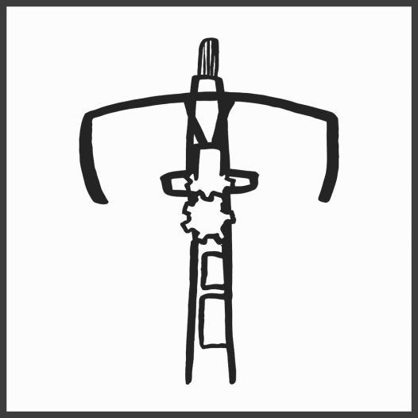

# Backwards bike

Backwards-bike

Normal bike

> images by Ashley Bartholomew

From [u/saltywhenwet](https://www.reddit.com/r/Physics/comments/49335e/comment/d0pb45x/?utm_source=share&utm_medium=web3x&utm_name=web3xcss&utm_term=1&utm_content=share_button) his experience building and learning to ride a backwards-bike,

The next day was very weird. While i was driving to work, I saw a bicycleist aside the road. Almost immediately, I could not drive my vehicle. Looking at the bike made the connection to the previous day relearning how to steer and I literally could not control my car. I stopped in the middle of the road, terrified and pulled to the side to regroup my thoughts. It took me about 5 minuets to start driving again. That was the only time I forgot how to drive a car while I was driving.

