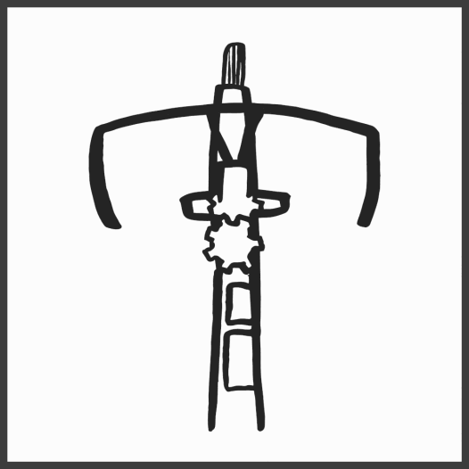

# Backwards bike and dvorak

Backwards-bike, "QWERTY"

Normal bike, "DVORAK"

> images by Ashley Bartholomew

A chief complaint I hear about people who are staunch on *not* learning an alternative keyboard layout is that they won't be able to use other people's computers. But is this really the case... Let's find out!

## Myself

I will call upon my own testimony as that is one I trust most.

Let me put it to you like this - say you spent your entire childhood, adolesence and some adulthood using qwerty - perhaps you even learnt to touch-type. You'll have chiselled away at a rock, leaving you a statue-of-sorts based on your efforts.

> _"If you don't use it you'll lose it"_

I have known dvorak for four years, only using it strictly for one year. Before that I touch typed dvorak on my mobile keyboard for four years. I can still pick up any old phone and hammer away at the qwerty keys without breaking a sweat

## Could I be wrong?

Let's leave it to time to prove me right or wrong :)

From [u/saltywhenwet](https://www.reddit.com/r/Physics/comments/49335e/comment/d0pb45x/?utm_source=share&utm_medium=web3x&utm_name=web3xcss&utm_term=1&utm_content=share_button) his experience building and learning to ride a backwards-bike,

The next day was very weird. While i was driving to work, I saw a bicycleist aside the road. Almost immediately, I could not drive my vehicle. Looking at the bike made the connection to the previous day relearning how to steer and I literally could not control my car. I stopped in the middle of the road, terrified and pulled to the side to regroup my thoughts. It took me about 5 minuets to start driving again. That was the only time I forgot how to drive a car while I was driving.
