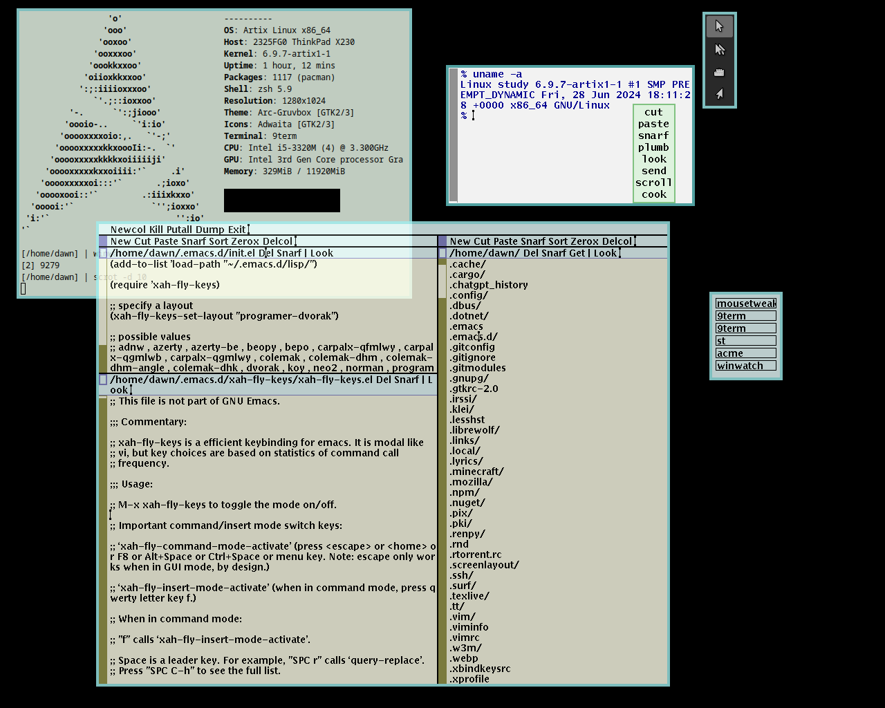
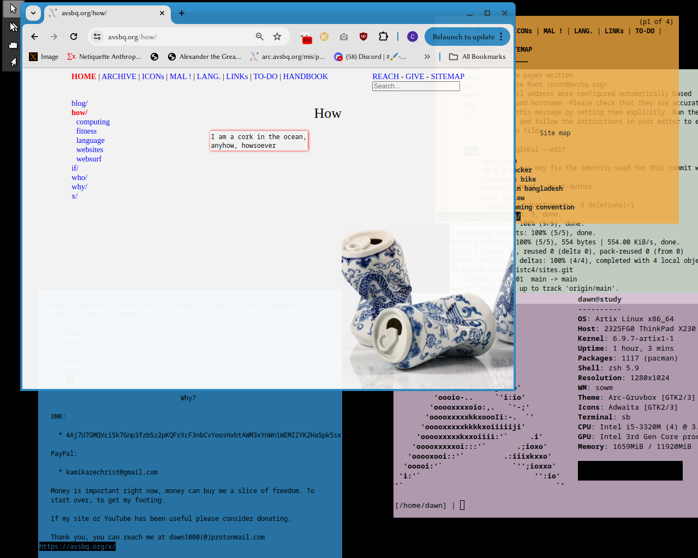
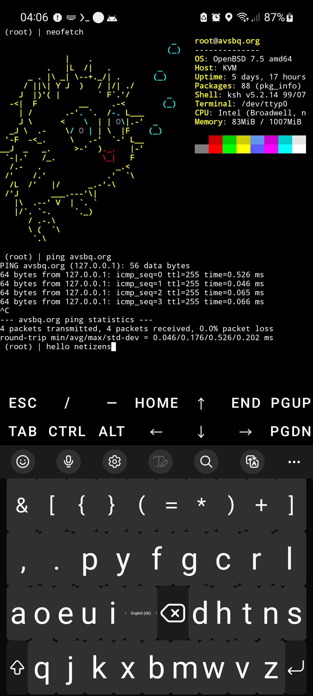

# Everything you'd want to know about my computing

*Last updated: 2024/09/05*

## Ergonomics

Ergonomics is first and foremost, you only have one body. Take care of it. 

I strictly use a standing desk. 

Standing desks by themselves can become torturous after the 4 hour mark, to mitigate this I'm researching walking treadmills or rollers.

I roll my shoulders and do neck-stretches.

When not typing I keep my wrists in a neutral position. I also try to nudge my mouse/trackball while my wrists are neutral

## Hardware

I use what I guess you'd call a &apos;headless&apos; laptop,

It's the motherboard of a corebooted ThinkPad x230

It is quite an exhibitionist... And I've now elevated it for better airflow.
Sidenote: Laptops with their motherboards encased feels like leaving your child in a locked car on a sweltering hot day :)

## Software

Top, Plan9 Rio. Middle, sowm. Bottom, termux

- *window manager*
	- [sowm](https://github.com/dylanaraps/sowm)
    - If I knew more about modifying rio, I'd probably use it, sowm is still uh-may-zin

- *EDITOR*: [acme](http://acme.cat-v.org), [bq](http://to-do.avsbq.org/bq), [vim](https://www.vim.org/), emacs
	- I use vim for the majority of my on-the-fly text editing, mainly because I haven't been working on my editor bq as much, although if I'm 'locked in' I'll spend several hours in acme

- *OS*:
	- [Artix](https://artixlinux.org/)(desktop)
	- [OpenBSD](https://openbsd.org)(server)
	- Windows 11, yes I know, I'm playing around seeing how close I can strip it down and customise shiet

- *TERMINAL*:
	- [st](https://st.suckless.org/)

- File manager
	- [lf](https://github.com/gokcehan/lf)

- Image editing
	- [ImageMagick](https://imagemagick.org/)
	- [ditherit](https://ditherit.com/)
	- [gThumb](https://gitlab.gnome.org/GNOME/gthumb)

- Video editing
	- [ffmpeg](https://www.ffmpeg.org/)
	- [VivaVideo](https://vivavideo.tv/) pro on Android, NOTE: VivaVideo is a Chinese company, I wouldn't edit anything sensitive

- Browser
	- [Chromium](https://www.chromium.org/Home/)
	- NOTE: Brave, Firefox don't work with mousetweaks, only Chrome based browsers and Qutebrowser do strangely
	- [surf](https://surf.suckless.org)

- Browser extensions
	- [Zhong Wen](https://github.com/cschiller/zhongwen), shows pinyn and definition over Chinese characters
	- [UBlock Origin](https://ublockorigin.com/)
	- [GoFullPage](https://gofullpage.com/), screenshots
	- [Vimium](https://vimium.github.io/), better keyboard shortcuts
	- [Bookmark Sidebar](https://extensions.redeviation.com/)

- MISCELLANEOUS

	- [mousetweaks](https://man.archlinux.org/man/extra/mousetweaks/mousetweaks.1.en), auto-clicker for general purposes
	- [totop](https://hbk.avsbq.org/cs/linux/xorg_raise_window), to raise windows with one key-press
	- [gammastep](https://hbk.avsbq.org/cs/linux/gammastep), I don't use dark theme

## Peripherals

- *MONITOR*: Dell 19" P1914Sc P1914Sf 1280x1024 SXGA 4:3
- *Keyboard*
	- [Maltron 2D](https://www.maltron.com/store/p13/Maltron_L89_dual_hand_ergonomic_flat_%282D%29_keyboard_-_UK_English.html), see my [video review](https://youtu.be/plvqPfsZ9uY?si=dY-HjHellQ-mzlML)
- *Trackball*
	- Traxys Esterline, Microsoft Explorer
- *Mouse*
	- Logitech G502 Hero, Contour Large Left-Handed
